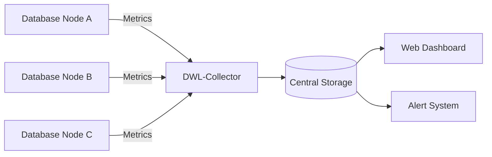

# 🌍 Database World Log (DWL)

[](https://opensource.org/licenses/MIT)
[]()
[]()

**Database World Log (DWL)** adalah sistem pemantauan pangkalan data terpusat yang direka untuk mengumpul, menganalisis, dan memaparkan metrik prestasi pangkalan data dari pelbagai kluster global dalam satu papan pemuka (*dashboard*).


---

## 🚀 Ciri-Ciri Utama

* **Global Observability:** Pantau latensi dan *throughput* pangkalan data merentas pelbagai rantau (AWS, Azure, GCP).
* **Real-time Alerting:** Notifikasi automatik melalui Slack/Discord jika penggunaan CPU atau RAM melebihi ambang (*threshold*).
* **Log Standardization:** Menukar log dari pelbagai jenis DB (PostgreSQL, MySQL, MongoDB) ke dalam format JSON yang seragam.
* **Anomalies Detection:** Menggunakan algoritma mudah untuk mengesan *query* yang luar biasa perlahan.

---

## 🛠️ Arkitektur Sistem

Sistem ini terdiri daripada tiga komponen utama:

1.  **DWL-Agent:** Skrip ringan yang dipasang pada pelayan DB untuk menghantar metrik.
2.  **DWL-Collector:** API berprestasi tinggi yang menerima dan memproses log.
3.  **DWL-Dashboard:** Antaramuka web untuk visualisasi data.

### Aliran Data



---

## 📦 Struktur Repositori

```text
database-world-log/
├── agents/             # Skrip pengumpul data (Python/Go)
├── collector/          # Backend API (Node.js/FastAPI)
├── dashboard/          # Frontend (React/Next.js)
├── docs/               # Dokumentasi tambahan & API Spec
├── scripts/            # Skrip automasi deployment (Docker/K8s)
└── README.md

```

---

## ⚡ Cara Bermula

### Prasyarat

* **Docker & Docker Compose**
* **Node.js v18+** (untuk dashboard)
* **Python 3.9+** (untuk agents)

### Pemasangan Pantas

1. **Klon Repositori:**
```bash
git clone [https://github.com/user/database-world-log.git](https://github.com/user/database-world-log.git)
cd database-world-log

```


2. **Lancarkan Infrastruktur (Central Log):**
```bash
docker-compose up -d

```


3. **Konfigurasi Agent:**
Edit fail `agents/config.yaml` dan masukkan API Key anda, kemudian jalankan agent:
```bash
python agents/main.py --config agents/config.yaml

```


---

## 📊 Metrik Yang Dipantau

Kami memfokuskan kepada **Golden Signals** pangkalan data:

| Metrik | Deskripsi | Unit |
| --- | --- | --- |
| **Latency** | Masa tindak balas purata query | ms |
| **Throughput** | Jumlah transaksi sesaat (TPS) | req/s |
| **Errors** | Kadar kegagalan sambungan/query | % |
| **Saturation** | Penggunaan disk I/O dan memori | % |

---

## 🤝 Sumbangan (Contributing)

Kami mengalu-alukan sebarang sumbangan! Sila baca `CONTRIBUTING.md` untuk panduan lanjut.

1. **Fork** projek ini.
2. Cipta **Branch** baru (`git checkout -b feature/AmazingFeature`).
3. **Commit** perubahan anda (`git commit -m 'Add some AmazingFeature'`).
4. **Push** ke *Branch* tersebut (`git push origin feature/AmazingFeature`).
5. Buka **Pull Request**.

---

## 📄 Lesen

Diedarkan di bawah Lesen MIT. Lihat `LICENSE` untuk maklumat lanjut.

---

**Dibuat dengan ❤️ oleh komuniti Database World Log.**

```

Boleh saya bantu sediakan fail `docker-compose.yml` asas untuk memulakan servis *collector* dan *database* simpanan anda?

```
