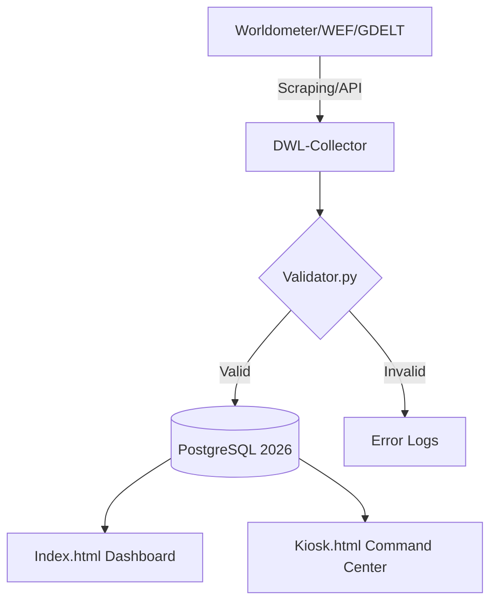

# 🌍 Database World Log (DWL) - Global Command Center 2026

[]()
[]()
[]()

**Database World Log (DWL)** adalah sistem pemantauan pangkalan data terpusat yang direka untuk mengumpul, menganalisis, dan memaparkan naratif dunia tahun 2026. Ia merangkumi metrik prestasi pangkalan data, kestabilan kewangan, agenda politik global, dan statistik populasi masa-nyata.

---

## 🏛️ Bidang Liputan Utama (2026 Focal Points)

Sistem ini memantau empat tiang utama tamadun melalui integrasi API dan Web Scraping:
1.  **Politik & Agenda:** Memantau naratif World Economic Forum (WEF) 2026 dan kestabilan geopolitik.
2.  **Financial:** Tracker inflasi global, pasaran saham, dan hutang negara.
3.  **Academic & Research:** Jurnal penyelidikan terkini dan kemajuan AI.
4.  **World Stats:** Data populasi, kesihatan, dan tenaga melalui Worldometer.

---

## 🛠️ Arkitektur Sistem & Aliran Data

Sistem ini menggunakan modul Python untuk mengekstrak data dan memaparkannya dalam UI futuristik.



---

## 📦 Struktur Repositori (Full Blueprint)

Sila bina fail berikut mengikut hierarki ini:

```text
database-world-log/
├── core/
│   ├── config_api.json       # Pusat simpanan kunci API (WEF, GDELT, NewsAPI)
│   ├── logger.py             # Logik penyimpanan log global
│   └── validator.py          # Pengesahan data & integriti nombor
├── modules/
│   ├── politics.py           # Tracker agenda negara & naratif WEF
│   ├── finance.py            # Tracker pasaran & inflasi 2026
│   ├── academic.py           # Research papers & OpenAlex API
│   ├── worldometer_scraper.py# Skrip live counters populasi/kesihatan
│   └── global_narrative.py   # Sentiment analysis berita dunia
├── data/
│   └── logs/                 # Fail JSON hasil monitoring
├── ui/
│   ├── index.html            # Dashboard Pemantauan Utama
│   ├── kiosk.html            # Paparan Mod Command Center (High-Visibility)
│   └── assets/               # CSS (Tailwind) & JS (Chart.js)
├── docker-compose.yml        # Setup Database (PostgreSQL/TimescaleDB)
└── README.md                 # Dokumentasi Induk (Fail ini)

```

---

## 🔗 Senarai API & Sumber Data Terpusat

| Kategori | Sumber | Endpoint/Metrik Utama |
| --- | --- | --- |
| **Global Stats** | Worldometer | Populasi, Kematian, Perbelanjaan Kesihatan |
| **Global Agenda** | WEF Strategic IQ | Global Risks 2026, Spirit of Dialogue |
| **Geopolitik** | GDELT Project | News Narratives & Conflict Monitoring |
| **Ekonomi** | World Bank/AlphaV | GDP Growth, Stock Index, Forex |
| **Akademik** | OpenAlex | AI Research, Scientific Breakthroughs |

---

## ⚡ Cara Bermula (Quick Start)

1. **Sediakan Persekitaran:**
```bash
git clone [https://github.com/user/database-world-log.git](https://github.com/user/database-world-log.git)
cd database-world-log
pip install requests beautifulsoup4 pandas

```


2. **Konfigurasi API:**
Isi fail `core/config_api.json` dengan API Key anda.
3. **Luncurkan Kiosk:**
Buka `ui/kiosk.html` dalam pelayar anda untuk melihat paparan *live monitoring*.

---

## 📄 Lesen & Etika Data

Sistem ini mematuhi etika pengumpulan data awam. Penggunaan data **Worldometer** dan **WEF** adalah untuk tujuan analisis dan pemantauan akademik sahaja.

**Dibuat dengan ❤️ untuk pemantauan masa depan manusia 2026.**

```

```
